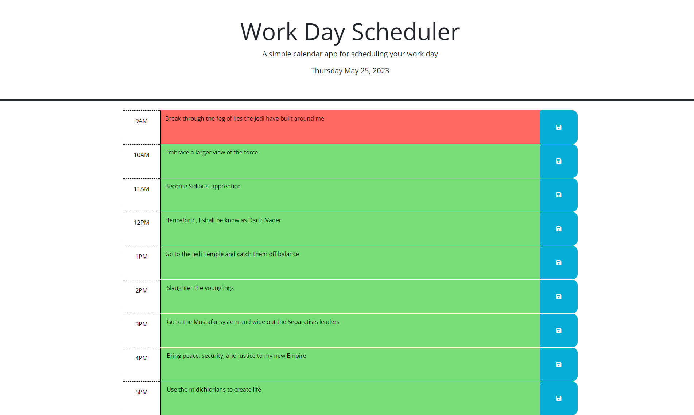

# Coding Quiz App

## Description

### User Story
AS AN employee with a busy schedule
I WANT to add important events to a daily planner
SO THAT I can manage my time effectively

### Acceptance Criteria

GIVEN I am using a daily planner to create a schedule
WHEN I open the planner
THEN the current day is displayed at the top of the calendar
WHEN I scroll down
THEN I am presented with time blocks for standard business hours
WHEN I view the time blocks for that day
THEN each time block is color-coded to indicate whether it is in the past, present, or future
WHEN I click into a time block
THEN I can enter an event
WHEN I click the save button for that time block
THEN the text for that event is saved in local storage
WHEN I refresh the page
THEN the saved events persist

## Installation

N/A It's a website!

## Usage

This page is a great way to keep track of everything that needs to get done during business hours! Enter what you've got in your schedule into each time block and don't forget to hit the save button. 

## Credits

Columbia Coding Bootcamp

And you for visiting my page!

## License

MIT License